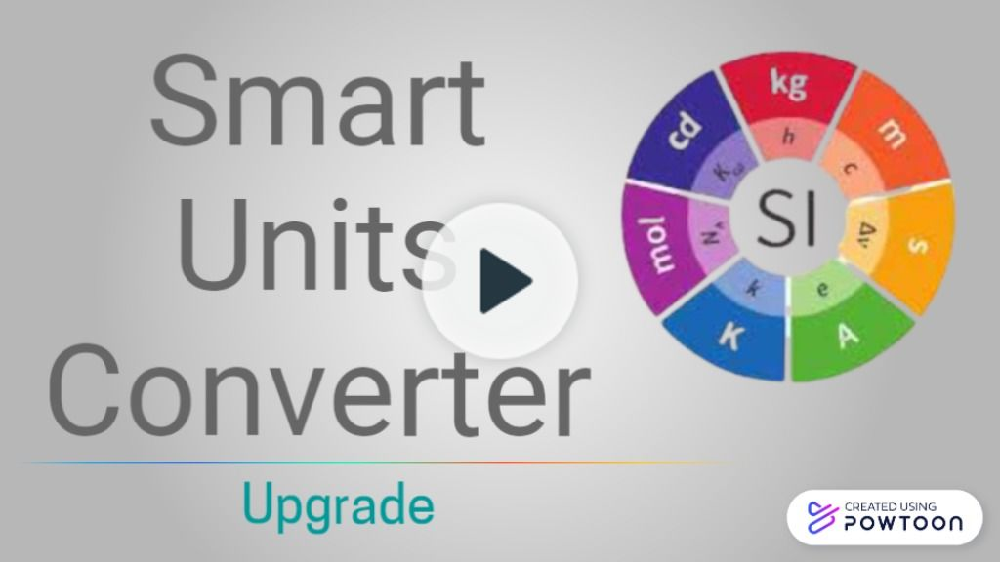

# Smart Units Converter - Browser Extension

An extension that converts your selected values into popular units. Saves time, Makes life easier:dancer:

Click on the image below to preview the working of the extension 

## Installation

-   Clone the repository using `git clone https://github.com/se20z09/units_converter_extension`
-   In Google Chrome browser open `chrome://extensions/`
-   Enable `Developer Settings` if it is not enabled
-   Choose `Load Unpacked`
-   Select the repository folder that was cloned in the first step
    
-   The extension will now be enabled in Google Chrome
    
-   Screenshot of the extension in action:
    

## Languages

-   JavaScript
-   HTML
-   CSS

## Documentation

Source documentation can be found at: [Units Converter Extension Docs](https://se20z09.github.io/units_converter_extension/).

## Software Requirements

-   [Node.js v12.18.4](https://nodejs.org/en/download/)
-   [NPM v6.14.6](https://nodejs.org/en/download/)

## Static Analysis Tools

### IDE and Code Formatter

-   [Visual Studio Code](https://code.visualstudio.com/) IDE
-   [Prettier Formatter for Visual Studio Code](https://github.com/prettier/prettier-vscode/blob/main/README.md)
-   [Upstatement Prettier Config](https://www.npmjs.com/package/@upstatement/prettier-config)

*   Prettier is an opinionated code formatter. It enforces a consistent style by parsing your code and re-printing it with its own rules that take the maximum line length into account, wrapping code when necessary.

### Code Coverage

-   [Istanbul with nyc](https://istanbul.js.org/) - Local coverage
-   [Coveralls](https://coveralls.io/) - Continuous integration coverage
-   Code coverage is automatically output on every pull request via Coveralls bot and on every local test via the `npm test` script.
-   <b>Installation:</b> all necessary modules are installed by running `npm install` from the root directory of the repository.

### Syntax Checker
-   [eslint](https://eslint.org/docs/user-guide/getting-started)
-   [Upstatement eslint Config](https://www.npmjs.com/package/@upstatement/eslint-config)

### Other Automated Tools
-   [Husky Git Hooks](https://www.npmjs.com/package/husky)

### Installation
-   All dependencies and static analysis tools can be automatically installed by running `npm install` in the root of the cloned repo after installing Node.js
