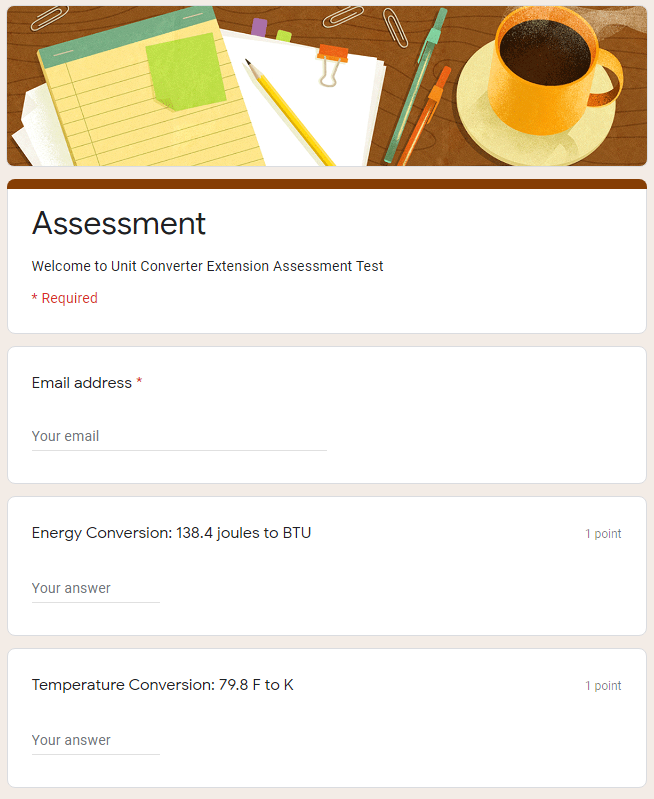

# Materials for Project 3

## Rationale
Welcome and thank you for considering our work for Project 3! 
Reasons to use this project:
- <b>Easy to install!</b> Simply clone the repo and get up and running in Chrome with 3 clicks.
- <b>Easy to quantify!</b> A simple math test will show how much time this extension saves over using a calculator or search engine.
- <b>Easy to use!</b> Just highlight a value and unit with your cursor and the app does the rest.

This means you can get your testers online and providing meaningful data within 2 minutes, saving valuable testing time.

## Materials Provided
-   Sample experimental protocol
-   Proposed metrics
-   Premade Google Forms math test - auto-graded, auto-shuffled, and ready to use!

## Proposed Metrics
-   Time to finish test
-   Number of questions completed
-   Avg. time per question
-   Ratio of correct answers
-   Preferred tool - Smart Units app or other?

### Testing Protocol
1. Create the assessment. 
 * Google Forms provide a convience means to create quizzes and also captures responses so that the team can perform analytics on the response. 
 * In order to maintain anonymity, participants can be issued a token or id, which they can enter into the form.
2. Create the answer key.
 * While creating the questionaire on google forms, you will be provided an option to provide the answer for each question. On providing the answer key, the responses will be automatically evaluated.
3. Send out the quiz
 * The quiz must be made available to the participants.
 * There are multiple options 
    - Share the link or email the link to the participants.
    - Post the link on your website, or github repository.
    - Use a shortened version of the url - Tiny URL, Tiny CC.
4. Feedback
 * Provide participants the opportunity to give feedback, inorder to improve the progress.
 *  Identify the pros and cons of the experimental setup and the software in general.
5. Results and Analytics
 * If the answer keys are provided, the responses are automatically evaluated.
 * From the data obtained perform exploratory data analysis to draw inference from the experiment.
